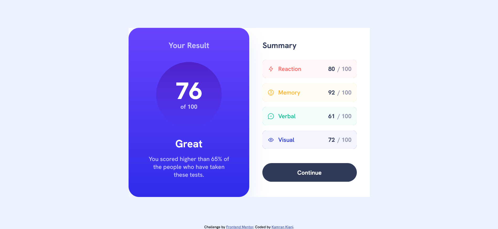

# Frontend Mentor - Results summary component solution

This is a solution to the [Results summary component challenge on Frontend Mentor](https://www.frontendmentor.io/challenges/results-summary-component-CE_K6s0maV).

## Table of contents

- [Frontend Mentor - Results summary component solution](#frontend-mentor---results-summary-component-solution)
  - [Table of contents](#table-of-contents)
  - [Overview](#overview)
    - [The challenge](#the-challenge)
    - [Screenshot](#screenshot)
    - [Links](#links)
  - [My process](#my-process)
    - [Built with](#built-with)
    - [What I learned](#what-i-learned)
  - [Author](#author)

## Overview

### The challenge

Users should be able to:

- View the optimal layout for the interface depending on their device's screen size
- See hover and focus states for all interactive elements on the page
- Use the local JSON data to dynamically populate the content

### Screenshot

### Links

- Solution URL: [Github](https://github.com/kaamiik/Result-Summary)
- Live Site URL: [Vercel](https://result-summary-eight-sandy.vercel.app/)

## My process

### Built with

- Semantic HTML5 markup
- CSS custom properties
- Flexbox
- JavaScript
- Fetch Api

### What I learned

Using Fetch api for adding my json file to js and make the page dynamic with javascript.

## Author

- Frontend Mentor - [@kaamiik](https://www.frontendmentor.io/profile/kaamiik)

